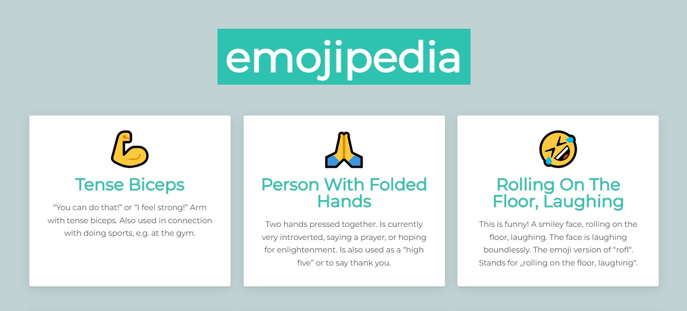

# 😄 React Emojipedia App


A simple React project that dynamically renders a list of emojis with their titles and meanings using reusable components, **props**, and the **map()** function.

> [!NOTE]
> This is a small learning project built to practice React components, props, mapping, and ES6 arrow functions.

---

## 🖼️ Demo
<p align="center">
  
</p>

---

## 📑 Table of Contents

- [Features](#-features)
- [Project Structure](#-project-structure)
- [Technologies Used](#-technologies-used)
- [Getting Started](#-getting-started)
- [Usage](#-usage)

---

## ✨ Features

- Dynamic rendering of emoji entries using **map()**  
- Reusable **React components** (`App`, `Entry`)  
- Data passed via **props**  
- Uses **ES6 arrow functions**  
- Clean, responsive dictionary layout  
- Easy to extend — just add new emojis to the array  

---

## 🧩 Project Structure

- `App.jsx`: Main component mapping over emoji data  
- `Entry.jsx`: Displays each emoji, name, and meaning  
- `emojipedia.js`: Data file containing emoji objects  
- `index.js`: Entry point rendering the React app  
- `styles.css`: Styling for emoji dictionary layout  
- `vite.config.js`: Vite configuration  
- `package.json` & `package-lock.json`: Project metadata and dependencies  
- `.gitignore`: Files/folders to ignore in Git  
- `README.md`: Project documentation

---

## 🛠️ Technologies Used

| Frontend | Build Tool | Language | Styling | Package Manager |
|-----------|-------------|-----------|-----------|----------------|
| React 19 | Vite | JavaScript (ES6, JSX) | CSS | npm |

---

## 🚀 Getting Started

1. **Clone the repository**
   ```bash
   git clone https://github.com/pouriavj/react-emojipedia.git
   cd react-emojipedia
